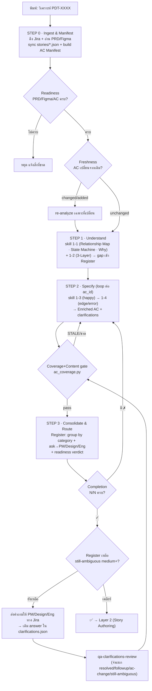

# RUNBOOK — วิธีรัน BA+QA Pipeline (operator guide)

> เปิดไฟล์นี้เวลาจะ **ลงมือทำ** — ดูว่าครั้งนี้ต้อง "พิมพ์/รันอะไร" และได้อะไรกลับมา
> อยากรู้ว่า process **คืออะไร/ทำไม** → `layer-1-ba-requirement-analysis.md` (spec เต็ม) · `README.md` (architecture)

**ตอนนี้ Layer 1 ใช้งานจริงได้** (L2/L3 ยัง draft — runbook จะเพิ่มเมื่อ finalize)

---

## 🗺️ Layer 1 — BA Requirement Analysis (flowchart)



---

## ⌨️ รันอะไรแต่ละครั้ง (cheat sheet)

| สถานการณ์ | พิมพ์ / รัน |
|---|---|
| เริ่มวิเคราะห์ story/epic ใหม่ | พิมพ์ **`วิเคราะห์ PDT-XXXX`** (dispatcher → process/layer-1) |
| Jira story เปลี่ยน / อยากดึงล่าสุด | พิมพ์ **`sync PDT-XXXX`** (skill `qa-story-diff`) |
| เช็คว่า AC ครบ + ไม่ stale | **`python3 checks/ac_coverage.py qa/PDT-XXXX`** |
| หลัง sync AC ใหม่ (ยืนยัน baseline) | **`python3 checks/ac_coverage.py qa/PDT-XXXX --update`** |
| PM ตอบ clarifications กลับมา | เติม `answer` ใน **`qa/PDT-XXXX/clarifications.json`** → รัน skill **`qa-clarifications-review`** |
| จะไป Layer 2 ได้ยัง? | ต้อง **Completion N/N ✓** + Register **ไม่มี still-ambiguous medium+** |

---

## 📋 แต่ละ STEP — รันอะไร ได้อะไร gate อะไร

**STEP 0 · Ingest & Manifest** — เรียก MCP `getJiraIssue` + `qa-story-diff`
- ทำ: ดึง story ล่าสุด, อ่าน PRD/Figma, sync `products/<epic>/stories/*.json`, build AC Manifest
- gate: **Readiness** (input ครบ?) → **Freshness** (diff vs snapshot)
- ได้: AC Manifest + `.ac-manifest.json`

**STEP 1 · Understand** — เรียก skill `phase-1-1` + `phase-1-2`
- ทำ: Relationship Map (Who) · State Machine (What) · Pain&Consequence (Why) · 3-Layer trace
- ได้: artifacts เหล่านั้น + gap questions เข้า **Clarification Register**

**STEP 2 · Specify** (loop ต่อ ac_id) — เรียก skill `phase-1-3` → `phase-1-4`
- ทำ: enrich happy path → หา edge/error (4 mental models) — ใช้ State Machine/Relationship Map จาก STEP1
- gate: **Coverage+Content** → `python3 checks/ac_coverage.py qa/<epic>`
- ได้: `qa/<epic>/<story>-analysis.md`

**STEP 3 · Consolidate & Route**
- ทำ: รวม Register (group by Conflict/Unclear/Ambiguous + tag ask→ใคร + priority) + readiness verdict
- gate: **Completion** (✓/✗ ทุก ac_id = N/N) · **Dropout** (ห้าม AC หลุด)
- ได้: `qa/<epic>/PDT-XXXX-clarifications-for-pm-design.md` (+`-en.md`)

**→ Handoff:** เข้า Layer 2 เมื่อ answer loop เคลียร์ (ไม่เหลือ still-ambiguous medium+)

---

## 🔁 Answer loop (เมื่อ PM/Design/Eng ตอบ)

```
คำถามอยู่ที่ qa/<epic>/clarifications.json (answer ledger, อ้างด้วย id: CONF-07, GAP-02, ...)
   → PM ตอบใน Jira (comment อ้าง id / แก้ AC ตรงๆ)
   → เติม field "answer" ต่อ id
   → qa-clarifications-review จำแนก + เขียน resolution/status กลับ
   → ถ้า AC เปลี่ยน: sync + ac_coverage.py --update
```

---

## 📂 ไฟล์อยู่ที่ไหน

| | Path |
|---|---|
| **Input** (PM/Design เป็นเจ้าของ) | `products/<epic>/{prd,design,stories}/` |
| Enriched AC (ผลลัพธ์ STEP2) | `qa/<epic>/<story>-analysis.md` |
| Clarification Register (คนอ่าน) | `qa/<epic>/PDT-XXXX-clarifications-for-pm-design.md` (+ `-en.md`) |
| Answer ledger (machine + gate) | `qa/<epic>/clarifications.json` |
| AC snapshot (gate baseline) | `qa/<epic>/.ac-manifest.json` |

---

## 📖 อ่านที่ไหน (doc map)

| อยากได้ | ไฟล์ |
|---|---|
| **จะรัน** (คู่มือนี้) | `process/RUNBOOK.md` |
| process L1 แบบ spec เต็ม | `process/layer-1-ba-requirement-analysis.md` |
| architecture + reuse map + gate catalog | `process/README.md` |
| L2/L3 (draft) | `process/layer-2-…md`, `process/layer-3-…md` |
| เทคนิคแต่ละ skill | `.claude/skills/phase-1-*/SKILL.md` (ดู `## Artifacts`) |
| schema (Schema 1/2) | `00-schema-process-guide.md` |
```
